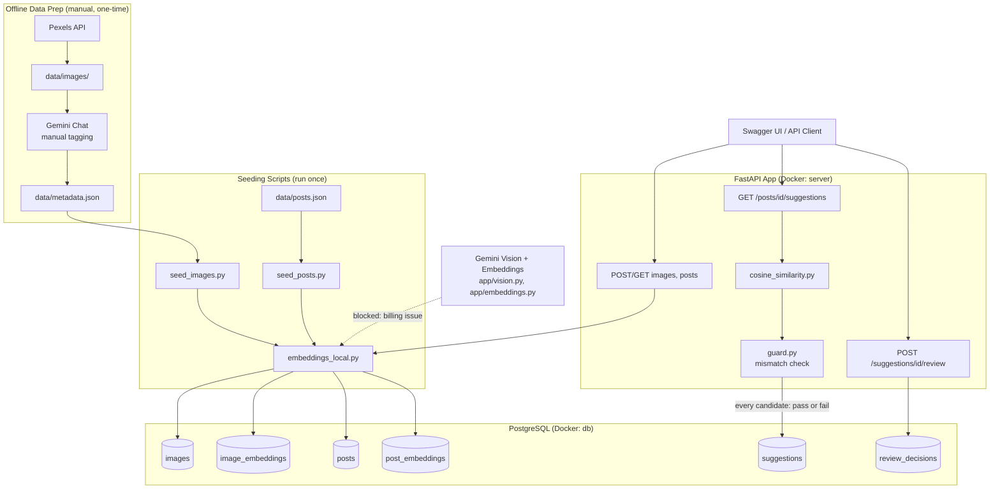

# Image Relevance

AI Image Understanding & Content Matching Engine. Tags images with a vision model, matches them to blog posts by meaning, and rejects bad matches with an explanation

## Architecture



## Setup

1. **Clone repo and create .env file:**

```
cp .env.example .env
```

Make sure to fill in `DATABASE_URL`, `POSTGRES_PASSWORD`, `HF_TOKEN` (not necessary, although *GREATLY* recommended. `PEXELS_API_KEY` and `GEMINI_API_KEY` are only required if you want to rerun fetch_dataset, or vision/embedding pipeline against live APIs.

2. **Build and start containers:**

```
docker compose up --build
```

This starts postgres and fastAPI server. Wait for `Uvicorn running on http://0.0.0.0:8000` in logs

3. **Initialize database Schema**

```
docker compose exec server python -m scripts.init_db
```

4. **Seed images and posts with embeddings**

```
docker compose exec server python -m scripts.seed_images
docker compose exec server python -m scripts.seed_posts
```

5. **Open Swagger UI to try API:** Run `http://localhost:8000/docs` in a browser
6. **Run automated tests:**

```
docker compose exec server python -m pytest tests/ -v
```

7. **Run evaluation script:**

```
docker compose exec server python -m scripts.evaluate
```

## Evaluation

**Top-1 Prediction: 6/7 (85.71%):** Measured against a manually labeled evaluation set `data/eval_labels.json`, which was computed via `scripts/evaluate.py`. For each post, the script checks whether the single highest similarity image matches a manually confirmed "correct" image_id for that post.

The one miss is the deliberately off-topic post included to test the mismatch guard. Therefore, since it has no genuinely correct image, its top ranked prediction is always counted as incorrect by design. Excluding that case, precision on subject-matched posts is 6/6 or 100%.

To run it yourself, run this (bash):

```
docker compose exec server python -m scripts.evaluate
```

## Testing

Automated tests to cover schema validation, mismatch guard rejection, and cosine similarity logic.

To run it yourself, run this (bash):

```
docker compose exec server python -m pytest tests/ -v
```

## Limitations

**Gemini API Free Tier:** The vision pipeline, `app/vision.py` and `app/batch.py` is fully implemented with retries and rate-limit pacing to stay under the 15RPM range for 3.5 Flash-Lite. However, the Gemini API Free Tier is simply not sufficient to run the vision model on each of the 50 images in the dataset, and funding will be required to run. A cost tracking infrastructure has been implemented in `app/vision.py`, however it has not been verified against a Gemini API call. The same problem is present with Gemini embedding.

My workaround was to pre-generate Metadata via Gemini Chat, and thus pasting in the given data into `data/metadata.json`, and will later be called. I also used a local embedder: `sentence-transformers` to embed images while keeping everything free.

**Local Embeddings Model:** The local embedding model `all-MiniLM-L6-v6` does not support semantic matching. This was proven by `tests/test_semantic_matching`, where *"Red Fox"* and *"Goldfish"* matched closer than *"Red Fox"* and *"Vulpes vulpes."* However, proper semanic matching would be most likely be possible with Gemini's `gemini-embedding-002` model.
